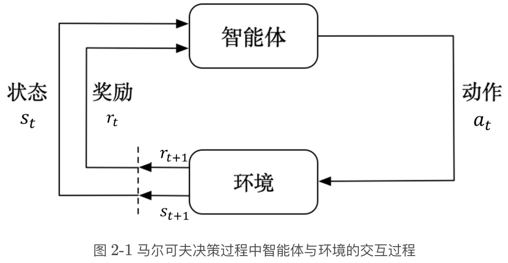
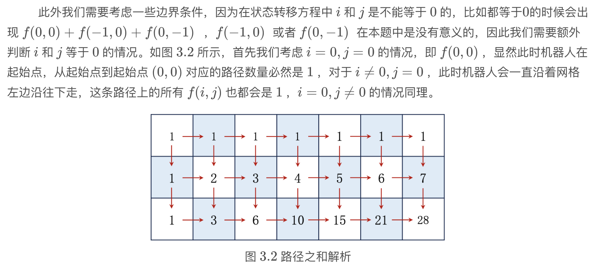

## Markov Decision Process

Markov过程表现以概率动态变化的结构，是很简化的模型，也是强化学习的基础。Markov性质指下一步的状态只和这一步有关，没有记忆。



注意这里的顺序，时刻$t$，agent 在状态$s_t$和奖励$r_t$的环境下，做出$a_t$的行为。比较重要的是奖励，写成

$$
\begin{aligned}
G_t &= r_{t+1} + \gamma r_{t+2} + \gamma^2 r_{t+3}+\cdots\\
&r_{t+1}+\gamma G_{t+1}
\end{aligned}
$$

它跟现金流折现是一模一样的，很好理解。而 MDP 作为强化学习的豌豆射手，就是叠加奖励和动作的Markov过程

$$
\text{Markov}过程\xrightarrow{+奖励}\text{Markov}奖励过程 (MRP)\xrightarrow{+动作}\text{Markov}决策过程 (MDP)
$$

## 动态规划


$$
f(i,j)=\begin{cases}
0 & i=0,j=0\\
1 & i=0,j\neq 0\\
1 & i\neq 0,j=0\\
f(i-1,j) + f(i,j-1) & i\neq 0,j\neq 0
\end{cases}
$$

分类讨论是要留意贴边的特殊情况，在编码中也要初始化边界

```python
def solve(m,n):
    # 初始化边界条件
    f = [[1] * n] + [[1] + [0] * (n - 1) for _ in range(m - 1)] 
    # 状态转移
    for i in range(1, m):
        for j in range(1, n):
            f[i][j] = f[i - 1][j] + f[i][j - 1]
    return f[m - 1][n - 1]
```

这里 `f = [[1] * n] + [[1] + [0] * (n - 1) for _ in range(m - 1)]` 是比较 pythonic 的写法，假设$m=4,n=3$，发现

```raw
f = [[1, 1, 1], [1, 0, 0], [1, 0, 0], [1, 0, 0]]
```

$$
f=\begin{bmatrix}
1 & 1 & 1 & 1\\
1 & 0 & 0 & 0\\
1 & 0 & 0 & 0
\end{bmatrix}
$$

**Bellman Equation**

$$
\begin{aligned}
    s_t\xrightarrow{a_t} & s_{t+1}\\
    & (r_{t+1})\\
\end{aligned}
$$

附：JoyRL typo
---

**2.3**


将贝尔曼公式 $\Rightarrow$ “讲”贝尔曼公式

**2.4**


景止环境 $\Rightarrow$ 静止环境


注意条件部分，公式应为：$P_{12}=P(S_{t+1}=s_2\vert S_{t}=s_1)$

**3.1**



第二行公式加号应为等号：$f(0,0)=f(-1,0)+f(0,-1)$

