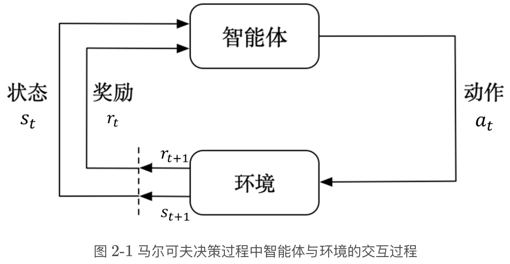
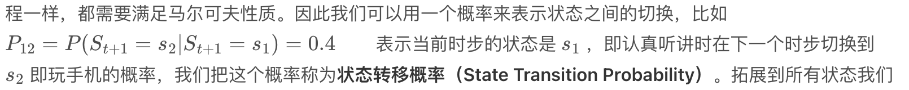
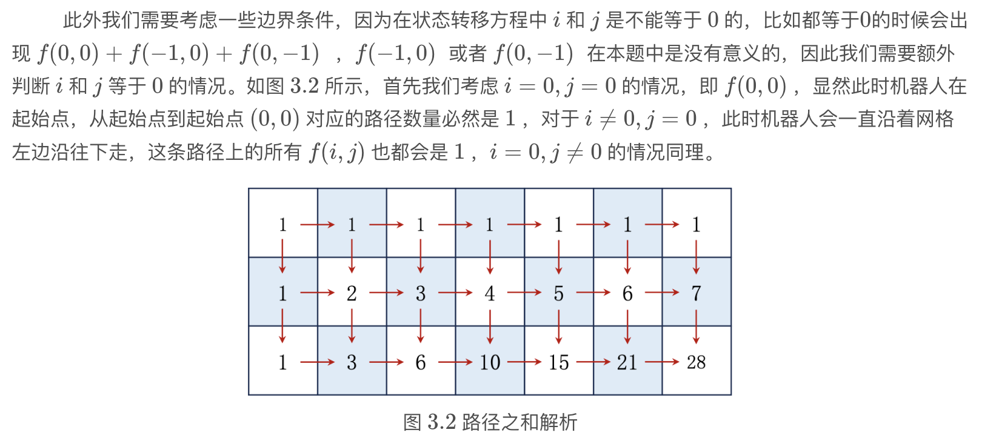

## Markov Decision Process

Markov过程表现以概率动态变化的结构，是很简化的模型，也是强化学习的基础。Markov性质指下一步的状态只和这一步有关，没有记忆。

<center>

</center>

注意这里的顺序，时刻$t$，agent 在状态$s_t$和奖励$r_t$的环境下，做出$a_t$的行为。

MDP 作为强化学习的豌豆射手，就是叠加奖励和动作的Markov过程

$$
\text{Markov}过程\xrightarrow{+奖励}\text{Markov}奖励过程 (MRP)\xrightarrow{+动作}\text{Markov}决策过程 (MDP)
$$

## 动态规划

### 一道面试题

<center>
    
</center>

$$
f(i,j)=\begin{cases}
0 & i=0,j=0\\\
1 & i=0,j\neq 0\\\
1 & i\neq 0,j=0\\\
f(i-1,j) + f(i,j-1) & i\neq 0,j\neq 0
\end{cases}
$$

分类讨论是要留意贴边的特殊情况，在编码中也要初始化边界

```python
def solve(m,n):
    # 初始化边界条件
    f = [[1] * n] + [[1] + [0] * (n - 1) for _ in range(m - 1)] 
    # 状态转移
    for i in range(1, m):
        for j in range(1, n):
            f[i][j] = f[i - 1][j] + f[i][j - 1]
    return f[m - 1][n - 1]
```

这里 `f = [[1] * n] + [[1] + [0] * (n - 1) for _ in range(m - 1)]` 是比较 pythonic 的写法，假设$m=4,n=3$，发现

```raw
f = [[1, 1, 1], [1, 0, 0], [1, 0, 0], [1, 0, 0]]
```

$$
f=\begin{bmatrix}
1 & 1 & 1 & 1\\\
1 & 0 & 0 & 0\\\
1 & 0 & 0 & 0
\end{bmatrix}
$$

### RL中的动态规划

首先规范 Notation 很重要。基本型是 $S_t\xrightarrow{A_t}R_{t+1},S_{t+1}$，其中 $R_{t+1}$ 表示在状态 $S_t$ 时做 $A_t$ 的动作后收获的回报（这里用 $t+1$ 而不是 $t$ 纯粹是 convention，大部分 manual 上都这样写）。这个模型中有三个重要组成部分：策略、回报和状态价值（state value），都写成条件概率的形式

| 图 | 名字 | 表达式 |
|:---:|:---:|:---:|
| $S_t\rightarrow A_t$ | 策略 | $\pi(A_t=a\vert S_t=s)$ |
| $S_t,A_t\rightarrow R_{t+1}$ | 回报 | $P(R_{t+1}=r\vert S_t=s,A_t=a)$ |
| $S_t,A_t\rightarrow S_{t+1}$ | state probability | $P(S_{t+1}=s'\vert S_t=s,A_t=a)$ |

扩展到多期，图为

$$
S_t\xrightarrow{A_t}R_{t+1},S_{t+1}\xrightarrow{A_{t+1}}R_{t+2},S_{t+2}\xrightarrow{A_{t+2}}R_{t+3},\cdots
$$

上面的这一串行为和状态我们称作一个 trajectory。它的价值是所有的回报折现，这和金融和会计里现金流的折现是一样的，很好理解。

$$
G_t = R_{t+1} + \gamma R_{t+2} + \gamma^2 R_{t+3}+\cdots
$$

## Bellman Equation

首先定义 state value。对于一个状态集 $\mathcal{S}$，任取一个状态 $\forall s\in \mathcal{S}$，当 $t$ 时刻的状态 $S_t=s$ 时，由此展开的所有可能 trajectory 的回报（$G_t$）的期望

$$
V_{\pi}(s)=E[G_t\vert S_t=s]
$$

这个 $V_{\pi}(s)$ 就是 state value 的表达式。很直观地，它和当前状态 $s$ 以及策略 $\pi$ 有关，因此是基于 $s,\pi$ 的函数。

### 公式推导

现在有意思了。我们把 $G_t$ 换种形式写

$$
G_t=R_{t+1}+\gamma G_{t+1}
$$

整个 Bellman Equation 的推导都由上式展开

$$
\begin{aligned}
V_{\pi}(s)&=E[G_t\vert S_t=s]\\\
&=E[R_{t+1}+\gamma G_{t+1}\vert S_t=s]\\\
&=E[R_{t+1}\vert S_t=s]+\gamma E[G_{t+1}\vert S_t=s] \tag{$\star$}
\end{aligned}
$$

拆开后，也是很 intuitive 的看到，第一项是当期回报的期望，第二项是未来无限期回报的总期望

**第一项**

$$
E[R_{t+1}\vert S_t=s]=\sum_{i=1}^n\pi(a_i|s)\cdot E[R_{t+1}|S_t=s,A_t=a_i]
$$

$\pi(a_i|s)$ 是给定当前状态 $S_t=s$ 的情况下，做出行为 $a_i$ 的概率。很眼熟，这是 [law of iterated expextation (LIE)](https://en.wikipedia.org/wiki/Law_of_total_expectation)，可以把上式改写成

$$
E[R_{t+1}\vert S_t=s]=E\bigg[E(R_{t+1}\vert S_t=s,A_t=a_i)\bigg]
$$

其中

$$
E(R_{t+1}\vert S_t=s,A_t=a_i)=\sum_r P(R_{t+1}=r|S_t=s,A_t=a_i)r
$$

注：之后像这种 $P(R_{t+1}=r|S_t=s,A_t=a_i)$ 就简写成 $P(r|s,a_i)$

**第二项**

$$
E[G_{t+1}\vert S_t=s]=\sum_{s'}E[G_{t+1}|S_t=s,S_{t+1}=s']P(S_{t+1}=s'|S_t=s)
$$

因为 $G_{t+1}$ 跟上一期状态 $S_t$ 没关系（Markov性质），故

$$
E[G_{t+1}\vert S_t=s]=\sum_{s'}E[G_{t+1}|S_{t+1}=s']P(S_{t+1}=s'|S_t=s)=\sum_{s'}V_{\pi}(s')P(s'|s)
$$

将 $P(s'|s)$ 依行为 $a_i$ 展开为 $\sum_iP(s'|s,a_i)\cdot \pi(a_i|s)$，整理

$$
\begin{aligned}
\sum_{s'}V_{\pi}(s')P(s'|s)&=\sum_{s'}V_{\pi}(s')\sum_iP(s'|s,a_i)\cdot \pi(a_i|s)\\\
&=\sum_i \left[\sum_{s'}V_{\pi}(s')\right] P(s'|s,a_i)\cdot \pi(a_i|s)\\\
&=\sum_i \pi(a_i|s)\cdot \left[\sum_{s'}V_{\pi}(s') \cdot P(s'|s,a_i)\right]
\end{aligned}
$$

把处理后的两项代回 $(\star)$ 式，

$$
V_{\pi}(s)=\sum_i \pi(a_i|s)\cdot \left[ \sum_r P(r|s,a_i)\cdot r+\gamma\sum_{s'}V_{\pi}(s') \cdot P(s'|s,a_i)\right]
$$

注意这不是一个式子，而是对所有的 $s\in \mathcal{S}$ 都成立

这就是 state value 的 Bellman Equation，其实还有 action value 的，之后再说

**更新：Action value 的贝尔曼方程**

$$
E[G_t|S_t=s]=\sum_i \pi(a_i|s) E[G_t|S_t=s,A_t=a_i]
$$

其中 $E[G_t|S_t=s,A_t=a_i]=Q_{\pi}(s,a_i)$，也就是在策略 $\pi$ 下，给定状态和行动 $s,a$ 产生的价值。因为相比 $V_{\pi}(s)$ 纳入了行动 $a$，故称为 action value。因此上式也可写作

$$
V_{\pi}(s)=\sum_i \pi(a_i|s)\cdot Q_{\pi}(s,a_i) \tag{1}
$$

对比之前 state value 的贝尔曼方程

$$
V_{\pi}(s)=\sum_i \pi(a_i|s)\cdot \left[ \sum_r P(r|s,a_i)\cdot r+\gamma\sum_{s'}V_{\pi}(s') \cdot P(s'|s,a_i)\right]
$$

容易发现

$$
Q_{\pi}(s,a_i)=\sum_r P(r|s,a_i)\cdot r+\gamma\sum_{s'}V_{\pi}(s') \cdot P(s'|s,a_i) \tag{2}
$$

式 $(1)$ 是由 action value 推 state value，式 $(2)$ 是由 state value 推 action value

### 求解 Bellman Equation

推广为矩阵形式

$$
G_t=R_{t+1}+\gamma G_{t+1}\Rightarrow \vec{v_{\pi}}=\vec{r_{\pi}}+\gamma P_{\pi}\vec{v_{\pi}}
$$

其中 $P_{\pi}$ 是状态转移矩阵

$[解一]$ 矩阵求逆

$$
v_{\pi} = (I-\gamma P_{\pi})^{-1}r_{\pi}
$$

当状态很多时矩阵会非常大，求逆难度很高

$[解二]$ 数值解（迭代）

$$
v_{k+1}=r_{\pi}+\gamma P_{\pi}v_{k}
$$

可以证明 $\vec{v_{k}}\rightarrow \vec{v_{\pi}}, (k\rightarrow \infty)$

思路：设 $\delta_k=v_k-v_{\pi}$，用 $\delta$ 表示 $v_k,v_{k+1}$，再代入 $v_{k+1}=r_{\pi}+\gamma P_{\pi}v_{k}$，化简会发现 $\delta_{k+1}=\gamma P_{\pi}\delta_k$，所以 $\delta_{k+n}=(\gamma P_{\pi})^n\delta_k$。因为 $\gamma<1$，状态转移矩阵的范数 $\Vert P_{\pi}\Vert \leqslant 1$（概率不能超过 1），所以 $(\gamma P_{\pi})^n\rightarrow 0,n\rightarrow \infty$，因此 $\delta_k\rightarrow 0$. $\square$

> 参考：赵世钰



## 附：JoyRL typo

**2.3**


将贝尔曼公式 $\Rightarrow$ “讲”贝尔曼公式

**2.4**


景止环境 $\Rightarrow$ 静止环境



注意条件部分，公式应为：$P_{12}=P(S_{t+1}=s_2\vert S_{t}=s_1)$

**3.1**



第二行公式加号应为等号：$f(0,0)=f(-1,0)+f(0,-1)$

