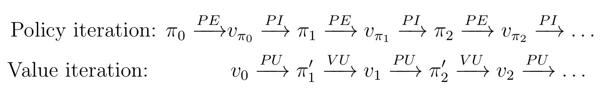
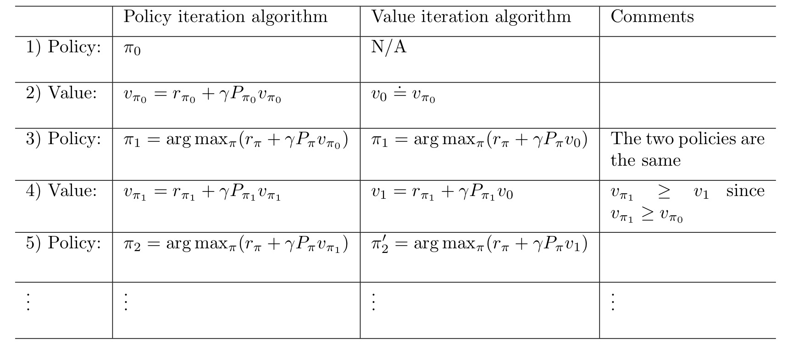
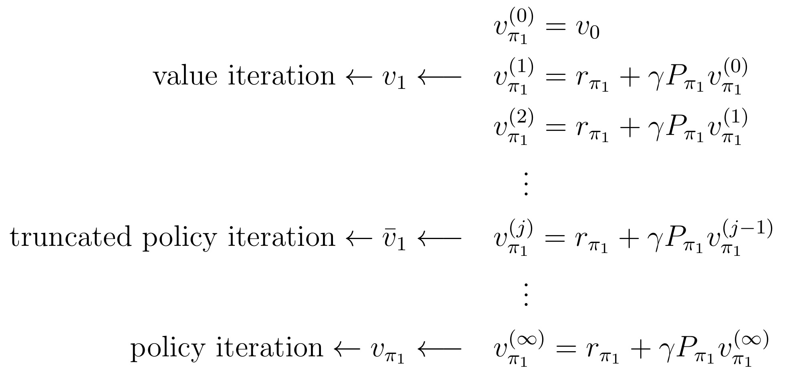

## Bellman Optimal Equation

回顾上次学的 Bellman Equation，它到底在做什么事情呢？我们先定义了 state value 和 action value，他们为什么重要，就是因为评价一个策略的好坏需要量化的指标，value 就是这样的一个指标。现在寻找最优策略的目标等价于寻找最大的 value 值。Bellman Equation 做的事就是用三个基本概率（策略、回报和状态），来表示 state value 或 action value。

$$
\pi(a|s),P(r|s,a),P(s'|s,a)\Rightarrow V(s),Q(s,a)
$$

Bellman Equation 的矩阵形式是

$$
v_{\pi}=r+\gamma P_{\pi}v_{\pi}
$$

我们的目标是首先最大化 $v_{\pi}$，然后找到对应的策略 $\pi$。所以我们面临的是这样一个最优化问题

$$
v_{\pi}=\max_{\pi} (r+\gamma P_{\pi}v_{\pi})
$$

其中 $r,P$ 都是模型中已知的，两个未知数为 $\pi,v$

先不管左边，单看右边就是个基本的最优化问题，此时变量是 $\max$ 下面的东西，其他都看作常数。我们把右边等式设做 $f$

$$
f(x)=\max_y(x^3-xy^2+y+3)
$$

为什么 $f(\cdot)$ 里只有 $x$ 没有 $y$ 呢？等我们做完优化后就显而易见了。

$$
\frac{\partial }{\partial y}(x^3-xy^2+y+3)=-2xy+1=0
$$

解得 $y=1/(2x)$，这是右边式子的最优解，当然严谨起见应该求 $f$ 的二阶导，验证 $f''<0$。Anyway，回代 $y$ 值，得到

$$
f(x)=x^3+\frac{1}{4x}+3
$$

优化后 $f$ 可以完全表示成 $x$ 的函数

回到贝尔曼最优方程，右式优化后，$\pi^*=\pi(v)$，整个右边可以表示成 $v$ 的函数 $f(v)$。

$$
v=f(v)
$$

由[不懂点原理](https://zh.wikipedia.org/zh-hans/%E5%B7%B4%E6%8B%BF%E8%B5%AB%E4%B8%8D%E5%8A%A8%E7%82%B9%E5%AE%9A%E7%90%86)，$v=f(v)$ 有唯一解，且迭代 $v_{k+1} = f(v_k)$ 会收敛。

接下来就介绍迭代求解 $v,\pi$ 的三种方法

## 三种迭代方法

1. Value iteration
2. Policy iteration
3. Truncated policy iteration

前两种迭代是第三种的基本型

### Value Iteration

值迭代分为两步：policy update (PU) 和 value update (VU)。

给定初始化的 $v_0$

Policy update:

$$
\pi_1 = \argmax_{\pi}(r_{\pi}+\gamma P_{\pi}v_0)
$$

Value update:

$$
v_1=r_{\pi_1}+\gamma P_{\pi_{1}}v_0
$$

得到 $v_1$ 后，再用于下一次迭代

### Policy Iteration

策略迭代也分为两步：policy evaluation (PE) 和 policy improvement (PI)

给定初始化的策略 $\pi_0$

Policy evaluation:

$$
v_{\pi_0}=r_{\pi_0}+\gamma P_{\pi_0}v_{\pi_0}
$$

把 $\pi_0$ 代入贝尔曼公式，用迭代求解 $v_{\pi_0}$（大迭代里的小迭代）

> $$v_{\pi_0}^{(j+1)}=r_{\pi_0}+\gamma P_{\pi_0}v_{\pi_0}^{(j)}$$

Policy improvement:

$$
\pi_1 = \argmax_{\pi}(r_{\pi}+\gamma P_{\pi}v_{\pi_0})
$$

### Truncated Policy Iteration

前三步是等价的，第四步开始有不同（Policy iteration 中小迭代的部分）：Policy 迭代直接把 $v_{\pi_1}$ 求了出来， Value 迭代则只往前迭代一步

