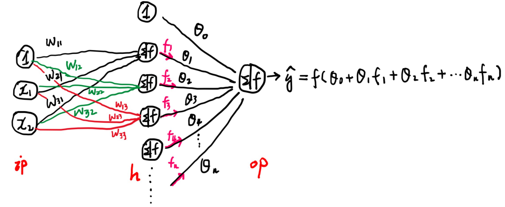
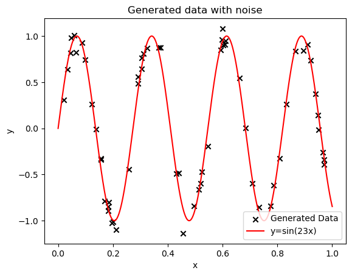
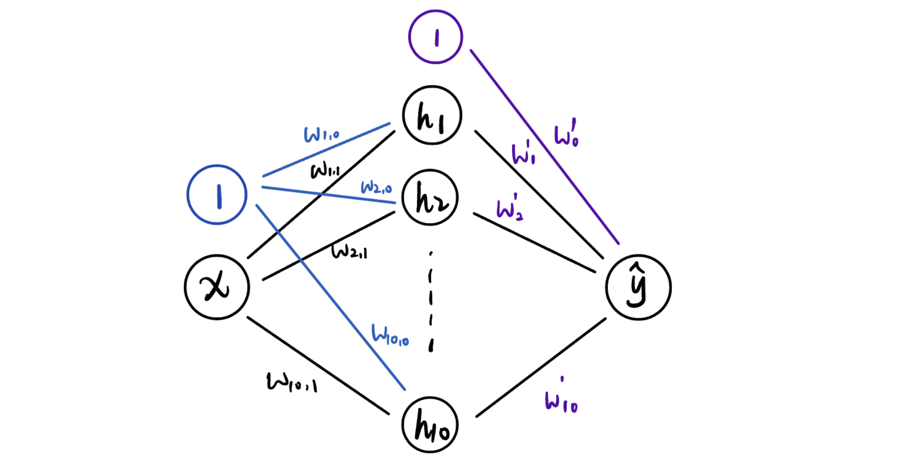
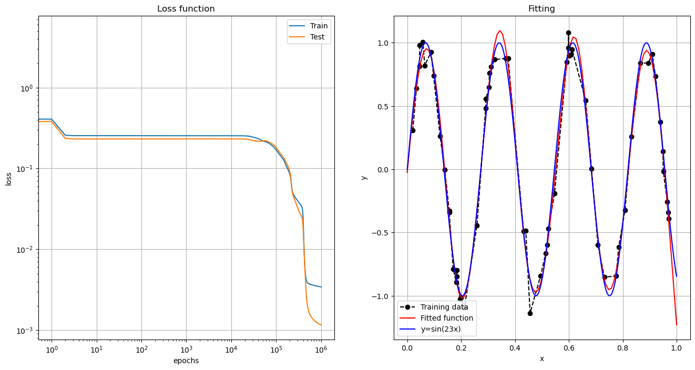
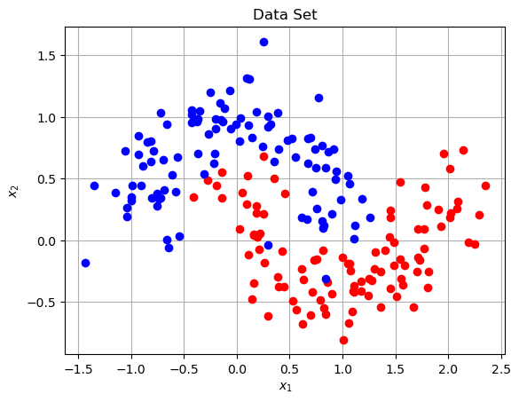
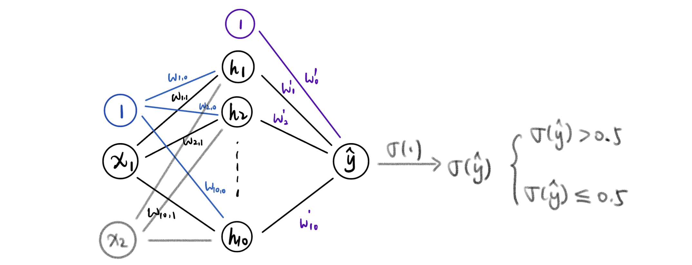
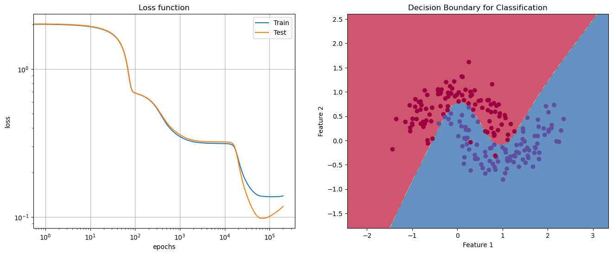

尝试实现一个通过 BP 算法训练的三层感知机算法，分别完成如下任务：

- 函数拟合，训练集由 $y=\sin(23x)\quad x\in[0,1]$ 加扰动生成的 60 个点。画出特征函数。
- 分类 `XX_train,yy_train = make_moons(n_samples=200, shuffle=True, noise=0.2, random_state=44)` 生成的数据集。并画出分类边界。
- 任选一个线性模型，跟多层感知机模型比较。

**提示**：隐含层神经元个数不需要太大，$10\sim 100$ 之间取值即可。

## 单隐含层 MLP



- 输入层（ip）：$1,x_1,x_2,\cdots,x_{ip}$
- 隐含层（h）：$1,f_1,\cdots,f_h$
- 输出层（op）：$\hat{y}_1,\cdots,\hat{y}_{op}$

其中 $ip$ 表示输入层神经元个数（输入向量维数），$op$ 是输出层神经元个数（输出向量维数），$h$ 是隐含层神经元个数。$1$ 乘以偏置项。

对样本量 $m=1$ ，输出一维数据 $op=1$ 的情况，输入 $[1,x_1,\cdots,x_{ip}]$，中间层传递 $[1,f_1,\cdots,f_h]$ 到输出层，最后输出 $\hat{y}=g(\Theta \cdot \vec{f})$。输入层到隐含层的转化如下，其中 $w_{ij}$ 为连接输入层第 $i$ 个节点和隐含层第 $j$ 个节点的权重（$1$包含在内）

$$
\underbrace{[1,f_1,\cdots,f_h]}_{1\times (h+1)}=f\bigg(\underbrace{[1,x_1,\cdots,x_{ip}]}_{1\times (ip+1)}\cdot \underbrace{\begin{bmatrix}
w_{11} & w_{12} & \cdots & w_{1,h+1}\\
w_{21} & w_{22} & \cdots & w_{2,h+1}\\
\vdots & \vdots & \ddots & \vdots\\
w_{ip+1,1} & w_{ip+1,2} & \cdots & w_{ip+1,h+1}
\end{bmatrix}}_{(ip+1)\times (h+1)}\bigg)
$$

## 函数拟合

训练集由 $y=\sin(23x)\quad x\in[0,1]$ 加扰动生成的 60 个点。画出特征函数。

```python
import numpy as np
import matplotlib.pyplot as plt

np.random.seed(42)
x_train = np.sort(np.random.rand(60, 1), axis=0)
y_train = np.sin(23 * x_train) + 0.1 * np.random.randn(60, 1)
plt.scatter(x_train, y_train, marker='x', color="black", label="Generated Data")
plt.plot(np.linspace(0,1,1000), np.sin(23 * np.linspace(0,1,1000)), 'r-', label="y=sin(23x)")
plt.xlabel("x")
plt.ylabel("y")
plt.title("Generated data with noise")
plt.legend(loc='lower right')
plt.show()
```



训练集是用 `numpy` 生成的 $(x,y)$，$x$ 作为一维输入，输出同样是一维的 $\hat{y}$。



**前向传播**

$$
x1*w\rightarrow \begin{bmatrix}1 & x^{(1)}\\1 & x^{(2)}\\  & \vdots\\ 1 & x^{(i)}\\ & \vdots\\1 & x^{(60)}\end{bmatrix}\begin{bmatrix}w_{1,0} & w_{2,0} & \cdots & w_{10,0}\\ w_{1,1} & w_{2,1} & \cdots & w_{10,1}\end{bmatrix} \rightarrow  \bigg[\quad \cdot \quad\bigg]_{60\times 10}
$$

```python
# 插入偏置项
def with_ones(array):
    array_with_ones = np.insert(array,0,1,axis=1)
    return array_with_ones

# 激活函数
def sigmoid(x):
    return 1 / (1 + np.exp(x))

def sigmoid_dev(x):
    return x * (1 - x)
```

```python
ip = 1  # 输入维数
h = 10  # 隐含层神经元数
op = 1  # 输出维数

# 初始化权重和偏置
weights_ih = np.random.rand(ip+1,h)
weights_ho = np.random.rand(h+1,op)
x1_train = with_ones(x_train)

hidden_input = np.dot(x1_train,weights_ih)
hidden_output = sigmoid(hidden_input)
hidden_output_with_ones = with_ones(hidden_output)
total_output = np.dot(hidden_output_with_ones,weights_ho)
y_pred = total_output
```

**Back Propagation**

$$
\delta_{out}=\hat{y}-y \quad [m\times op]
$$

$$
\underbrace{\Delta w_{ho}}_{(h+1)\times op} = \underbrace{(\overbrace{\mathbf{h1}}^{m\times (h+1)}.T)}_{(h+1)\times m}\cdot \underbrace{\delta_{out}}_{m\times op}
$$

$$
\underbrace{\delta_{hidden}}_{m\times h}=\underbrace{\delta_{out}}_{m\times op}\cdot \underbrace{w_{ho}^{T}}_{op\times h}*\underbrace{\mathbf{h}}_{m\times h}*(1-\mathbf{h})
$$

$$
\underbrace{\Delta w_{ih}}_{(ip+1)\times h}=\underbrace{(\mathbf{x1}^{T})}_{(ip+1)\times m}\cdot \underbrace{\delta_{hidden}}_{m\times h}
$$

$w_{ho}$ 拿掉第一行再转置（作为输出时偏置项不参与）

梯度下降：

$$
w_{ih} = w_{ih} - \frac{\alpha}{m} \cdot \Delta w_{ih}
$$

$$
w_{ho} = w_{ho} - \frac{\alpha}{m} \cdot \Delta w_{ho}
$$

```python
loss = 0.5 * np.mean((y_pred - y_train)**2)
alpha = 0.01
m = 60  # 样本量

# output layer delta
delta_out = y_pred - y_train
d_weights_ho = hidden_output_with_ones.T.dot(delta_out)

# hidden layer delta
delta_hidden = delta_out.dot(weights_ho[1:].T) * hidden_output * (1 - hidden_output)
d_weights_ih = x_train.T.dot(delta_hidden)

# 更新权重
weights_ih -= alpha / m * d_weights_ih
weights_ho -= alpha / m * d_weights_ho
```

**整理前向传播、反向传播**

从头开始，初始化权重和训练集，迭代训练

```python
ip = 1  # 输入维数
h = 10  # 隐含层神经元数
op = 1  # 输出维数
epochs = 1000000

# 初始化权重和偏置
weights_ih = np.random.rand(ip+1,h)
weights_ho = np.random.rand(h+1,op)
x1_train = with_ones(x_train)

# 初始化测试集
x_test = np.sort(np.random.rand(60, 1), axis=0)
y_test = np.sin(23 * x_test)
x1_test = with_ones(x_test)

# 记录loss
loss_train = np.zeros(epochs)
loss_test = np.zeros(epochs)

# 迭代
for epoch in range(epochs):    
    # 前向传播 (训练+测试)
    hidden_input = np.dot(x1_train,weights_ih)
    hidden_output = sigmoid(hidden_input)
    hidden_output_with_ones = with_ones(hidden_output)
    total_output = np.dot(hidden_output_with_ones,weights_ho)
    y_pred = total_output
    
    hidden_input_test = np.dot(x1_test,weights_ih)
    hidden_output_test = sigmoid(hidden_input_test)
    hidden_output_with_ones_test = with_ones(hidden_output_test)
    total_output_test = np.dot(hidden_output_with_ones_test,weights_ho)
    y_pred_test = total_output_test

    # 反向传播
    loss_train[epoch] = 0.5 * np.mean((y_pred - y_train)**2)
    loss_test[epoch] = 0.5 * np.mean((y_pred_test - y_test)**2)

    # output layer delta
    delta_out = y_pred - y_train
    d_weights_ho = hidden_output_with_ones.T.dot(delta_out)

    # hidden layer delta
    delta_hidden = delta_out.dot(weights_ho[1:].T) * hidden_output * (1 - hidden_output)
    d_weights_ih = x1_train.T.dot(delta_hidden)

    # 更新权重
    alpha = 0.2
    m = 60  # 样本量
    weights_ih -= alpha / m * d_weights_ih
    weights_ho -= alpha / m * d_weights_ho

    # 每1000次输出一次损失
    if epoch % 1000 == 0:
        print(f'Epoch {epoch}, Loss: {loss_train[epoch]}')

print(f"Training set loss value: {loss_train[-1]:.3f}")
print(f"Testing set loss value: {loss_test[-1]:.3f}")

# 输出：
# Training set loss value: 0.003
# Testing set loss value: 0.001
```

```python
plt.figure(figsize=(16,8))
plt.subplot(121)
plt.loglog(loss_train,label='Train')
plt.loglog(loss_test,label='Test')
plt.title("Loss function")
plt.grid(True)
plt.xlabel('epochs')
plt.ylabel('loss')
plt.legend()

# 绘制拟合结果
x_fit = np.linspace(0, 1, 100).reshape(-1, 1)
x1_fit = with_ones(x_fit)
fit_output = feedforward(x1_fit,weights_ih,weights_ho)

plt.subplot(122)
plt.title("Fitting")
plt.plot(x_train,y_train,'k--o',label='Training data')
plt.plot(x_fit,fit_output,"r-",label='Fitted function')
plt.plot(np.linspace(0,1,1000), np.sin(23 * np.linspace(0,1,1000)), 'b-', label="y=sin(23x)")
plt.xlabel('x')
plt.ylabel('y')
plt.legend()
plt.grid(True)
```



**实验记录**

1. 最初设置 `epochs=100000` 但迭代 1000 次后损失停在 0.25 左右的平台，降不下去
2. 接着试了两百万次，loss 降到 0.18，但仍未收敛
3. 继续试四百万次，降到 0.08，仍未收敛
4. 最后尝试了八百万次，降到 0.037，但实际上还是没收敛。考虑到可能学习率取 0.01 太小
5. 把学习率调到 0.1 时，迭代两百万次，很快降到 0.03，可见深度学习里学习率太小的问题
6. 把学习率调到 0.2 时，迭代一百万次，降到 0.0034

## 二分类

分类 `XX_train,yy_train = make_moons(n_samples=200, shuffle=True, noise=0.2, random_state=44)` 生成的数据集。并画出分类边界。

```python
from sklearn.datasets import make_moons
XX_train,yy_train = make_moons(n_samples=200, shuffle=True, noise=0.2, random_state=44)
plt.plot(XX_train[np.where(yy_train==1), 0], XX_train[(np.where(yy_train==1)), 1], 'ro')
plt.plot(XX_train[np.where(yy_train==0), 0], XX_train[(np.where(yy_train==0)), 1], 'bo')
plt.xlabel(r"$x_1$")
plt.ylabel(r"$x_2$")
plt.title("Data Set")
plt.grid(True)
```





输入二维数据，调试神经网络。注意新的损失函数为交叉熵（第一次算没有换损失，输出的loss都是`nan`）

$$
H(p,q)=-\sum_i (p_i\cdot \log(q_i))
$$

对于二分类问题，可简化为

$$
H(p,q) = -[p\cdot \log(q)+(1-p)\cdot \log(1-q)]
$$

```python
ip = 2  # 输入维数
h = 10  # 隐含层神经元数
op = 1  # 输出维数
epochs = 200000

# 初始化权重和偏置
weights_ih = np.random.rand(ip+1,h)
weights_ho = np.random.rand(h+1,op)
XX1_train = with_ones(XX_train)

# 初始化数据集
XX_train,yy_train = make_moons(n_samples=200, shuffle=True, noise=0.2, random_state=44)
XX_test,yy_test = make_moons(n_samples=200, shuffle=True, noise=0.2, random_state=42)
XX1_test = with_ones(XX_test)

yy_train = yy_train.reshape(200,1)
yy_test = yy_test.reshape(200,1)

# 记录loss
loss_train = np.zeros(epochs)
loss_test = np.zeros(epochs)

# 迭代
for epoch in range(epochs):    
    # 前向传播 (训练+测试)
    hidden_input = np.dot(XX1_train,weights_ih)
    hidden_output = sigmoid(hidden_input)
    hidden_output_with_ones = with_ones(hidden_output)
    total_output = np.dot(hidden_output_with_ones,weights_ho)
    yy_pred = sigmoid(total_output)
    
    hidden_input_test = np.dot(XX1_test,weights_ih)
    hidden_output_test = sigmoid(hidden_input_test)
    hidden_output_with_ones_test = with_ones(hidden_output_test)
    total_output_test = np.dot(hidden_output_with_ones_test,weights_ho)
    yy_pred_test = sigmoid(total_output_test)

    # 反向传播
    loss_train[epoch] = -np.mean(yy_train * np.log(yy_pred) + (1 - yy_train) * np.log(1 - yy_pred))
    loss_test[epoch] = -np.mean(yy_test * np.log(yy_pred_test) + (1 - yy_test) * np.log(1 - yy_pred_test))

    # output layer delta
    delta_out = (yy_pred - yy_train) * yy_pred * (1 - yy_pred)
    d_weights_ho = hidden_output_with_ones.T.dot(delta_out)

    # hidden layer delta
    delta_hidden = delta_out.dot(weights_ho[1:].T) * hidden_output * (1 - hidden_output)
    d_weights_ih = XX1_train.T.dot(delta_hidden)

    # 更新权重
    alpha = 0.1
    m = 60  # 样本量
    weights_ih -= alpha / m * d_weights_ih
    weights_ho -= alpha / m * d_weights_ho

    # 每1000次输出一次损失
    if epoch % 1000 == 0:
        print(f'Epoch {epoch}, Loss: {loss_train[epoch]}')

print(f"Training set loss value: {loss_train[-1]:.3f}")
print(f"Testing set loss value: {loss_test[-1]:.3f}")

# 输出
# Training set loss value: 0.139
# Testing set loss value: 0.118
```

```python
plt.figure(figsize=(16,6))
plt.subplot(121)
plt.loglog(loss_train,label='Train')
plt.loglog(loss_test,label='Test')
plt.title("Loss function")
plt.grid(True)
plt.xlabel('epochs')
plt.ylabel('loss')
plt.legend()

plt.subplot(122)
# 绘制分类边界
def plot_decision_boundary(X, y, model):
    h = 0.01
    x_min, x_max = X[:, 0].min() - 1, X[:, 0].max() + 1
    y_min, y_max = X[:, 1].min() - 1, X[:, 1].max() + 1
    xx, yy = np.meshgrid(np.arange(x_min, x_max, h), np.arange(y_min, y_max, h))
    Z = model(np.c_[xx.ravel(), yy.ravel()])
    Z = Z.reshape(xx.shape)
    plt.contourf(xx, yy, Z, cmap=plt.cm.Spectral, alpha=0.8)
    plt.scatter(X[:, 0], X[:, 1], c=y, cmap=plt.cm.Spectral)

# 定义模型函数
def predict(XX):
    XX1 = with_ones(XX)
    hidden_layer_input = np.dot(XX1, weights_ih)
    hidden_layer_output = sigmoid(hidden_layer_input)
    hidden_layer_output_with_ones = with_ones(hidden_layer_output)
    output_layer_input = np.dot(hidden_layer_output_with_ones, weights_ho)
    predicted_output = sigmoid(output_layer_input)
    return (predicted_output > 0.5).astype(float)

plot_decision_boundary(XX_train, yy_train.flatten(), predict)
plt.title('Decision Boundary for Classification')
plt.xlabel('Feature 1')
plt.ylabel('Feature 2')
plt.show()
```



