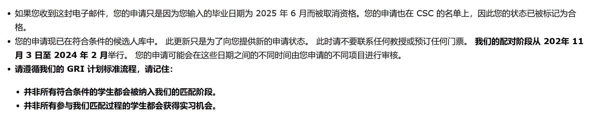

申请途径和网站：2024年加拿大Mitacs本科生實習合作獎學金遴選[通知](https://www.csc.edu.cn/chuguo/s/2669)、[加方申請portal](https://www.mitacs.ca/en/programs/globalink/globalink-research-internship)、[國家公派留學信息管理平台](http://apply.csc.edu.cn)

## 三件事 9.14

- [x] 打印成績單
- [x] 寫推薦信，找倪簽字
- [x] 寫三個小作文
   - General description of skills, background knowledge, research interests and experience
   - Notable Achievements
   - Briefly describe the research work you have completed

## 選項目 9.18

| Rank | Province        | Professor Name        | Project Title                                              |
|------|-----------------|-----------------------|-----------------------------------------------------------|
| 1    | Ontario         | Justin Wan            | Computational Finance using Machine Learning Techniques   |
| 2    | British Columbia| Christoph Ortner      | Mathematics of Scientific Machine Learning                |
| 3    | Ontario         | Apurva Narayan        | Quantum Machine Learning                                   |
| 4    | Nova Scotia     | Mohamed Drira         | Corporate Reporting Analytics: A Machine Learning Approach |
| 5    | Ontario         | Apurva Narayan        | Empowering Machine Learning using Quantum Computing       |
| 6    | British Columbia| Xuekui Zhang          | Statistical methods for big data analysis and its application in medical research |
| 7    | British Columbia| Xuekui Zhang          | Statistical methods and its application in diagnostic of virus infection |

## 第一封邮件 9.30

Dear Dafu,

Mitacs is no longer accepting 2024 Globalink Research Internship applications.

We are now reviewing all applications to determine their eligibility. Applicants will be notified of their eligibility in November.

You no longer will be able to modify your information on the platform. Your application PDF will now be available for download when you log in to the GRI Application Platform under the 'Application' tab.  

Important dates:  

**November 2023:**
Mitacs notifies each applicant of their eligibility and next steps  

**November 2023 to January 2024:**
Mitacs provides professors with a shortlist of student candidates for their project. Applicants may be interviewed by professors at any time of the matching process. Mitacs collects student and professor rankings.

**Mid-February 2024:**
Selected applicants receive an internship offer by mid-February 2024 and results are finalized

Due to the high volume of applicants, Mitacs cannot offer direct feedback on your application. Please be aware that eligibility and interviews do not guarantee an internship offer.

注意：

> **Due to the high volume of applicants, Mitacs cannot offer direct feedback on your application. Please be aware that eligibility and interviews do not guarantee an internship offer.**

因此面试通过确实不保证能进项目组，mitacs机制玄学

$\Rightarrow$ [一篇关于Mitacs的博客](https://shuosc.github.io/fly/posts/20-%CF%80-mitacs_gri/)

## 通过初筛 11.8

身边认识的两个同学都没通过mitacs的初筛，11.4 当日被拒了，很直接地说 `not eligible`。今年申请人数3w+，项目2k+。我 11.8 收到初筛通过邮件，进入下一阶段：从11月教授开始挑人，下次状态更新要到12月或1月中旬。

Dear Dafu Zhu,

Thank you for your interest in Mitacs’s Globalink Research Internship (GRI).

> We have completed our review of all GRI applications, and we are glad to inform you that your application is deemed eligible for a 2024 Globalink Research Internship. At this point, please do not contact any professors or book any tickets. This status update does not mean that you are granted a position for the 2024 Globalink Research Internship.

This email is only meant to provide information about the different status updates that you may receive during the next phase.

During the matching phase, your application may be updated to one of the following statuses:

1. Waitlisted:
There’s no action needed from you when you receive this status update. You will receive an email with a status update in mid-December and in mid-January; OR

2. Candidate under consideration:
There’s no action needed from you when you receive this status update.

i.Please do not contact any professors unless they reach out to you firstYou may or may not be
called for an interview. Please diligently check your email, including your spam or junk folders for any emails from professors. The format of the professor’s assessment or interview is up to the professor. If you have questions about logistics and our program, please contact `helpdesk@mitacs.ca`. Professors will not be able to answer any questions about funding, immigration, and travelling.

ii.Your status can change to waitlisted at any point; this is not reflective of the quality of your application.

iii.We'll consider your ranking during the matching process. However, your application can be matched with any project on your list, even if it's not your first choice.

iv.You will receive an email with a status update in mid-December or in mid-January.

Our matching phase is held from November 2023 to February 2024. Your application can be reviewed at different times between those dates, to the different projects you have applied to. Please note whether your status is “Waitlisted” or “Candidate under consideration” this does not reflect the quality of your application. Being “Waitlisted” implies that our team is working to find the best match for your profile.

Please note that Mitacs will make every effort to match eligible candidates with projects, within the scope of Government of Canada guidelines and/or directives on research security. Mitacs reserves the right to decline applications on the grounds of research security concerns or approve applications conditional on additional research security requirements as appropriate.

## Waitlist通知 11.11

上封邮件说12月和1月中旬开始匹配，这封应该所有人都一样的，先设成 `waitlist` 之后再更新。

> Thank you for your interest in Mitacs’s Globalink Research Internship (GRI). We are writing to inform you that your application status has been updated to “Waitlisted”.

Please note that no action is currently required.
Applicants are asked not to contact professors at this time.
You will receive an email with a new status update in mid-December and in mid-January.
Your application may or may not be updated to “Candidate Under Consideration”. If your status changes, Mitacs will
update your status and send you an email notification with further instructions.

Your current status does not reflect the quality of your application.
The Globalink Research Internship program is highly competitive with over 30,000 applications and limited availability; therefore, Mitacs cannot offer direct feedback on your application. All results will be finalized by the end of February 2024.

Please note that Mitacs will make every effort to match eligible candidates with projects, within the scope of Government of Canada guidelines and/or directives on research security. Mitacs reserves the right to decline applications on the grounds of research security concerns or approve applications conditional on additional research security requirements as appropriate.

## 乌龙

原来是 mitacs 那边犯的错误，对外说毕业月份不重要，但把很多填 2025.6 毕业的给筛掉了。